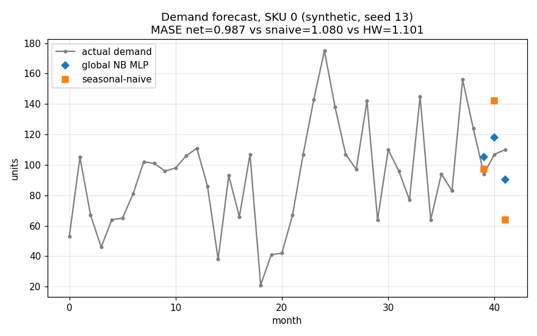
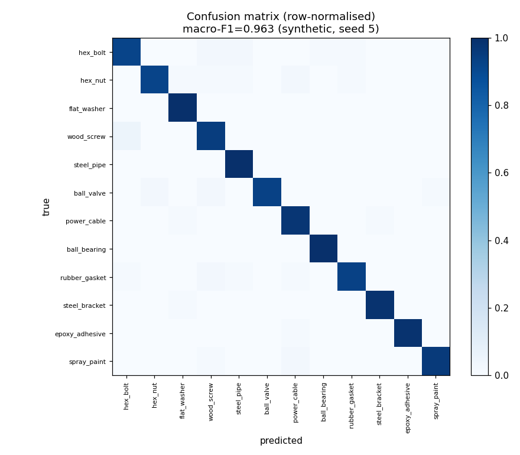
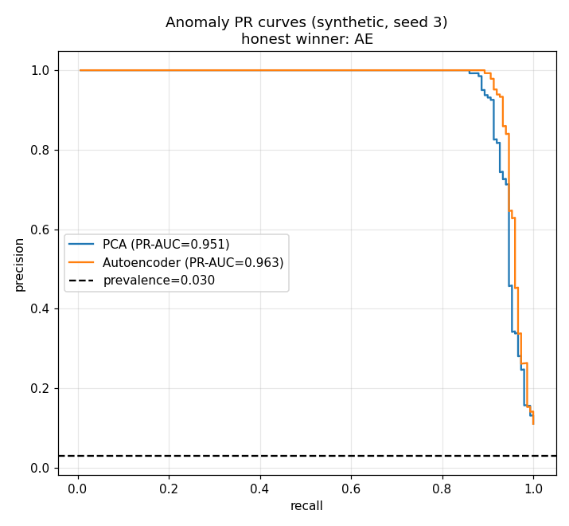
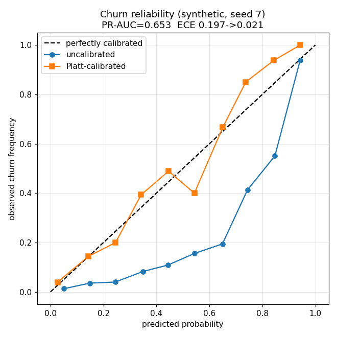
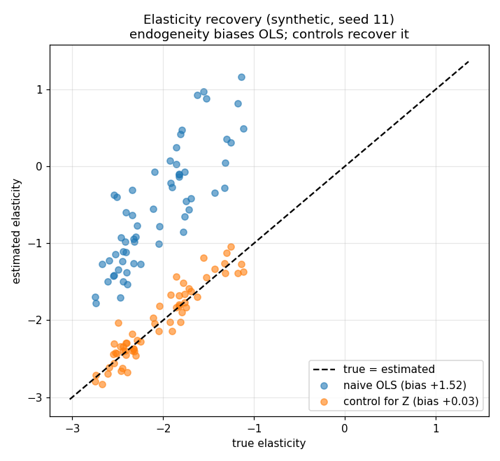

# ml-models-lab

This is a small lab of five machine-learning models I built from scratch for a
B2B distributor setting (demand, catalogue text, orders, customers, pricing).
Each one takes a published, well-regarded method, re-implements the core in
numpy or plain PyTorch, adds **one** principled improvement for the use case,
and is evaluated with a metric that survives the thing that actually breaks
these problems - class imbalance, short series, or lots of zeros - **not
accuracy**.

Everything trains on a laptop CPU in seconds to a few seconds. I kept each model
the smallest credible version that still demonstrates the method.

## Honesty and data note

**All data in this repo is synthetic and seeded.** There is no real customer,
order, or catalogue data anywhere. Each model ships its own generator in
`mllab/synth.py` with an explicit seed, so the same seed reproduces the same
numbers (the tests enforce this). The results below are exactly what the code
prints on my machine at the default seed - nothing is rounded up or cherry
picked. Where a from-scratch model does **not** clearly beat its simpler
baseline (the anomaly autoencoder vs PCA), I say so and keep the baseline in
front of you. No SOTA / "beats everyone" claims - these are deliberately tiny
models on toy data, meant to show the method and an honest evaluation.

## The five models

| Model | Base method | The one improvement | Metric | Measured result (seeded) |
|---|---|---|---|---|
| `demand-forecast-net` | DeepAR / N-BEATS global model | intermittent routing + Croston states as features; inverse-scale loss weighting | MASE / RMSSE, rolling-origin CV | **0.987 / 0.948**, beats seasonal-naive (1.080 / 1.062) and Holt-Winters (1.101 / 1.019) |
| `sku-text-classifier` | fastText hashed n-grams | regex sub-token split of part numbers + inverse-frequency class weights | macro-F1 | **0.963** vs majority-class 0.013 |
| `order-anomaly-ae` | reconstruction-error autoencoder | per-feature error explanation + clean-split percentile threshold; **mandatory PCA baseline** | PR-AUC / ROC-AUC / P@k | AE **0.963** PR-AUC vs PCA **0.951** (AE wins narrowly on this seed; PCA is the honest baseline) |
| `churn-rfm-predictor` | RFM + L2 logistic regression | declining-order-frequency slope + Platt calibration after class-weighting; time-based split | PR-AUC (+ Brier, ECE) | **0.653** PR-AUC vs recency 0.361 / prevalence 0.150; ECE 0.197 -> **0.021** after calibration |
| `price-elasticity-regressor` | Ridge + Lasso, log-log elasticity | hierarchical shrinkage of thin segments + endogeneity control | elasticity RMSE + profit regret | naive-OLS bias **+1.52** -> controlled **+0.03**; profit regret **0.89%** vs the analytic optimum |

## Shared benchmark (one scoring rule across all five)

The five models report in different natural metrics (MASE, macro-F1, PR-AUC,
elasticity RMSE), so [`mllab/benchmark.py`](mllab/benchmark.py) folds them into
one leaderboard with a single, direction-aware **skill score** - the fraction
of the fair baseline's error a model removes (lower-is-better metrics) or of the
headroom to a perfect score it captures (bounded higher-is-better metrics). It
reuses each model's own `train.run()` (no retraining code) and writes the
committed table [`docs/BENCHMARK.md`](docs/BENCHMARK.md). **All five models beat
their fair baseline** on this seeded synthetic data. The table is machine
generated - not hand-typed - and [`tests/test_benchmark.py`](tests/test_benchmark.py)
recomputes every cell and fails if it drifts from what the code produces.

### Bootstrap confidence intervals on the skill scores

A point skill score says a model beats its baseline, but not by how much or
whether the margin is bigger than evaluation noise.
[`mllab/uncertainty.py`](mllab/uncertainty.py) puts a non-parametric percentile
bootstrap **95% confidence interval** on the skill score of each **numpy** model
(`churn-rfm-predictor`, `price-elasticity-regressor`) by resampling the
evaluation units with replacement and recomputing the metric. It **reuses each
model's already-computed test-set predictions** (via the `eval_units` its
`train.run()` returns) - nothing is retrained, so the interval measures
*evaluation-set sampling* uncertainty, not training-seed uncertainty. On the
seeded data both intervals sit entirely above zero: churn skill **+0.457**
(95% CI **[+0.381, +0.528]**) and elasticity-RMSE skill **+0.918**
(95% CI **[+0.904, +0.934]**). The committed table is
[`docs/BENCHMARK_CI.md`](docs/BENCHMARK_CI.md).

Only the two numpy models are covered **on purpose**: they are deterministic on
every platform, so the intervals are bit-reproducible and CI-verifiable. The
three torch-trained models are excluded because their trained metric is not
bit-reproducible across BLAS/OS builds (the same reason
[`tests/test_benchmark.py`](tests/test_benchmark.py) pins only their labels and
beats flag), so a committed interval for them would be machine-dependent. As
everywhere in this repo, the skill score is a *within-model* diagnostic against
that model's fair baseline, not a cross-model ranking, and all data is synthetic
and seeded.

## How to run

Install the stack (numpy / scipy / pandas / matplotlib / torch):

```
pip install -r requirements.txt
```

Each model has a CLI entry point that trains, prints its metrics with plain
ASCII markers, and saves a labelled figure to `mllab/<model>/results/`:

```
python -m mllab.demand_forecast_net        # forecast fit, MASE/RMSSE table
python -m mllab.sku_text_classifier        # confusion matrix, macro-F1
python -m mllab.order_anomaly_ae           # PR curves, AE vs PCA
python -m mllab.churn_rfm_predictor        # reliability curve, PR-AUC
python -m mllab.price_elasticity_regressor # elasticity fit, endogeneity demo
```

Score all five under one rule and regenerate the leaderboard:

```
python -m mllab.benchmark                  # writes docs/BENCHMARK.md
```

Put bootstrap confidence intervals on the numpy models' skill scores:

```
python -m mllab.uncertainty                # writes docs/BENCHMARK_CI.md
```

Run the gates:

```
python -m ruff check .
python -m pytest -q
```

## What each model does (and its sources)

Short version below; the deeper spec with citations is in
[`docs/METHODOLOGY.md`](docs/METHODOLOGY.md), and each model has its own
`README.md` with the exact source URLs.

### `demand-forecast-net`

A global cross-series MLP (a "DeepAR-lite without
the RNN"): lags {1,2,3,12,13} + rolling means {3,6,12} + Fourier month
features + an 8-dim SKU embedding, with a negative-binomial head. Intermittent
SKUs are routed and fed Croston smoothed size/interval states. I weight the NB
loss by inverse series scale so training targets the scale-free MASE/RMSSE
metric instead of over-fitting the few high-volume SKUs. See
[`mllab/demand_forecast_net/README.md`](mllab/demand_forecast_net/README.md).



*Rolling-origin one-step forecasts for a representative seasonal SKU (synthetic,
seeded): the global NB MLP scores MASE **0.987** / RMSSE **0.948** vs
seasonal-naive 1.080 / 1.062 and Holt-Winters 1.101 / 1.019.*

With real data I would add explicit leakage checks that every feature window
ends strictly before the forecast origin (order cut-off timestamps, late-arriving
corrections) and re-run the rolling-origin backtest monthly to catch demand drift.

Model card: [`docs/model_cards/demand-forecast-net.md`](docs/model_cards/demand-forecast-net.md)

### `sku-text-classifier`

Hashed char n-grams (3-5) into an
`nn.EmbeddingBag(mean)` and a linear softmax (fastText core). Before hashing I
split alphanumeric part numbers with a regex (`M8x40` -> `m8`, `x40`, `8`,
`40`) so unseen SKUs are represented by their *shape*, and I use
inverse-frequency class weights so rare categories are not drowned. Reported
as **macro-F1**, not accuracy. See
[`mllab/sku_text_classifier/README.md`](mllab/sku_text_classifier/README.md).



*Row-normalised confusion matrix on the stratified synthetic test split:
macro-F1 **0.963** vs majority-class baseline 0.013.*

With real data I would audit label quality on a stratified sample before
training, because supplier-fed catalogue categories are typically noisy and a
clean macro-F1 on dirty labels is meaningless.

Model card: [`docs/model_cards/sku-text-classifier.md`](docs/model_cards/sku-text-classifier.md)

### `order-anomaly-ae`

An undercomplete autoencoder (d-16-4-16-d) trained on
normal orders only; the anomaly score is reconstruction error. The
**mandatory numpy PCA-SVD baseline** runs alongside it, and I report the
honest side-by-side. The AE also explains each flag by its top per-feature
errors. See [`mllab/order_anomaly_ae/README.md`](mllab/order_anomaly_ae/README.md).



*Precision-recall curves on the held-out synthetic mix: AE **0.963** PR-AUC vs
PCA **0.951** - a narrow win on this seed, which is why the PCA baseline stays
in the report.*

With real data I would re-estimate the contamination rate and the clean-split
threshold on a fresh verified-normal window at a fixed cadence, because
order-mix drift silently invalidates a fixed percentile cut.

Model card: [`docs/model_cards/order-anomaly-ae.md`](docs/model_cards/order-anomaly-ae.md)

### `churn-rfm-predictor`

Logistic regression written from scratch in numpy
(sigmoid, L2-penalised BCE, analytic gradient, full-batch GD), with
class-weighting and Platt calibration fit on held-out logits. Features include
an engineered declining-order-frequency slope, and the split is time-based to
avoid leakage. See
[`mllab/churn_rfm_predictor/README.md`](mllab/churn_rfm_predictor/README.md).



*Reliability curve on the time-based synthetic test split: Platt calibration
brings ECE **0.197 -> 0.021** at PR-AUC **0.653** (vs recency 0.361 /
prevalence 0.150).*

With real data I would recheck calibration on every scoring cycle and
recalibrate on the newest complete cohort, because churn base rates drift and
stale Platt parameters quietly mislead whoever consumes the probabilities.

Model card: [`docs/model_cards/churn-rfm-predictor.md`](docs/model_cards/churn-rfm-predictor.md)

### `price-elasticity-regressor`

Ridge (closed form via `scipy.linalg.solve`
plus gradient descent from scratch) and lasso (coordinate descent with
soft-thresholding) on per-segment log-log elasticity, with hierarchical
shrinkage of thin segments toward the pooled estimate. The synthetic data
bakes in a demand confounder, so I can show naive OLS is biased and adding the
control recovers the true elasticity - then translate that into simulated
profit regret vs the Lerner optimum. See
[`mllab/price_elasticity_regressor/README.md`](mllab/price_elasticity_regressor/README.md).



*True vs estimated elasticity per product (synthetic): naive OLS is biased
**+1.52**; adding the demand control brings the bias to **+0.03**, and pricing
from the shrunk estimates costs **0.89%** profit regret vs the analytic optimum.*

With real data I would replace the synthetic confounder control with an actual
instrument or observable cost-shifter, because without one the endogeneity bias
this figure demonstrates cannot be identified, let alone removed.

Model card: [`docs/model_cards/price-elasticity-regressor.md`](docs/model_cards/price-elasticity-regressor.md)

## Repo layout

```
mllab/
  synth.py            seeded synthetic data generators (all 5)
  metrics.py          from-scratch metrics (ROC/PR-AUC, MASE, ECE, macro-F1, ...)
  benchmark.py        shared harness: one skill score across all 5 -> docs/BENCHMARK.md
  uncertainty.py      bootstrap 95% CIs on the numpy models' skill -> docs/BENCHMARK_CI.md
  demand_forecast_net/
  sku_text_classifier/
  order_anomaly_ae/
  churn_rfm_predictor/
  price_elasticity_regressor/
tests/                deterministic + baseline-beating + invariant checks
docs/METHODOLOGY.md   the deeper spec, with citations
docs/model_cards/     one card per model (Mitchell et al. structure)
docs/MODEL_CARDS.md   roll-up table of all five cards (metric + baseline + limits)
docs/BENCHMARK.md     machine-generated leaderboard: one skill score across all 5
docs/BENCHMARK_CI.md  machine-generated bootstrap 95% CIs on the numpy skill scores
```

Every model package must ship a card: `tests/test_model_cards.py` fails if a
model is missing its card, if a card is orphaned, or if a card drops a required
section - so the documentation cannot silently drift out of sync with the code.

## License

© 2026 Dimitres Kisimov — all rights reserved; published for portfolio review. See LICENSE. Author: Dimitres Kisimov, 2026.
